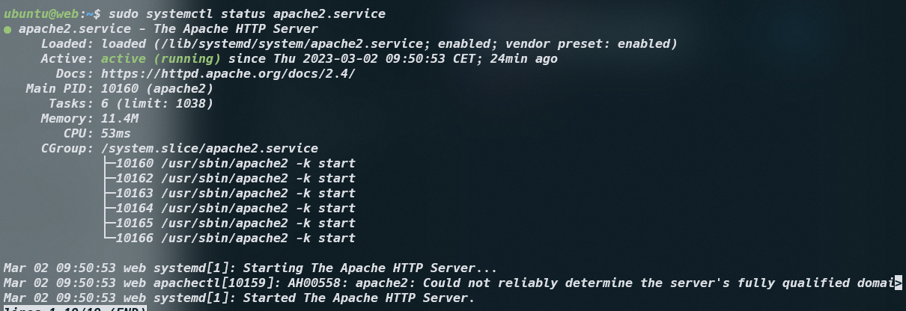
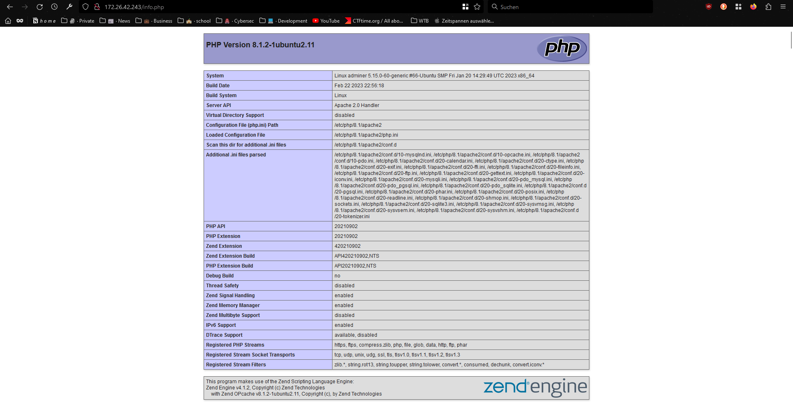
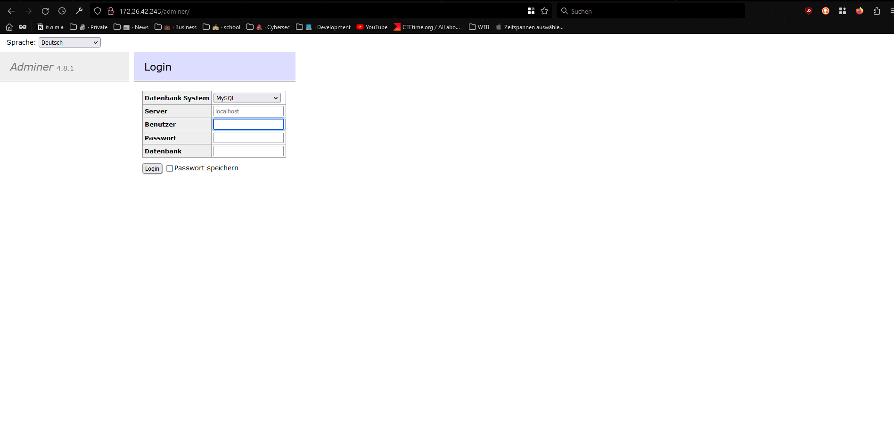

## A

**Cloud-Init Dateien verstehen**

```yaml
#cloud-config
users: # This section defines the users that will be created
  - name: ubuntu # The name of the user to be created
    sudo: ALL=(ALL) NOPASSWD:ALL # Allows the user to run any command as any user without a password prompt
    groups: users, admin # Assigns the user to the users and admin groups
    home: /home/ubuntu # Specifies the home directory for the user
    shell: /bin/bash # Specifies the default shell for the user
    lock_passwd: false # Allows the user to log in with a password
    plain_text_passwd: "password" # Sets the user's password to "password"


ssh_pwauth: true # Enables password authentication for SSH logins
disable_root: false # Allows the root user to log in
packages: # This section specifies which packages should be installed
  - apache2 # Installs the Apache2 web server
  - curl # Installs the command-line tool for transferring data
  - wget # Installs the command-line tool for retrieving files from the web
  - php # Installs the PHP scripting language
  - libapache2-mod-php # Installs the Apache2 module for PHP
  - php-mysqli # Installs the PHP MySQLi extension
```

## B

**Multipass Web Find**


**Apache Service**




## C

`cloudinit-adminer.yaml`

```yaml
#cloud-config
users:
  - name: ubuntu
    sudo: ALL=(ALL) NOPASSWD:ALL
    groups: users, admin
    home: /home/ubuntu
    shell: /bin/bash
    lock_passwd: false
    plain_text_passwd: "password"
ssh_pwauth: true
disable_root: false
packages:
  - apache2
  - curl
  - wget
  - php
  - libapache2-mod-php
  - php-mysqli
  - adminer
runcmd:
  - sudo a2enconf adminer
  - sudo systemctl restart apache2
write_files:
  - path: /var/www/html/info.php
    content: |
      <?php
      // Show all information, defaults to INFO_ALL
      phpinfo();
      ?>
    permissions: "0644"
  - path: /var/www/html/db.php
    content: |
      <?php
      //database
      $servername = "127.0.0.1";
      $username = "admin";
      $password = "password";
      $dbname = "mysql";
      // Create connection
      $conn = new mysqli($servername, $username, $password, $dbname);
      // Check connection
      if ($conn->connect_error) {
              die("Connection failed: " . $conn->connect_error);
      }
      $sql = "select Host, User from mysql.user;";
      $result = $conn->query($sql);
      while($row = $result->fetch_assoc()){
              echo($row["Host"] . " / " . $row["User"] . "<br />");
      }
      //var_dump($result);
      ?>
    permissions: "0644"
```

**db.php**
This file doesn't because it can't connect to the other database that is hosted in another vm, due the networking/routing.

**info.php**


**adminer**



`cloud-init-db.yaml`

```yaml
#cloud-config
users:
  - name: ubuntu
    sudo: ALL=(ALL) NOPASSWD:ALL
    groups: users, admin
    home: /home/ubuntu
    shell: /bin/bash
    lock_passwd: false
    plain_text_passwd: "password"

ssh_pwauth: true
disable_root: false
packages:
  - mariadb-server
runcmd:
  - sudo mysql -sfu root -e "GRANT ALL ON *.* TO 'admin'@'%' IDENTIFIED BY'password' WITH GRANT OPTION;"
```
