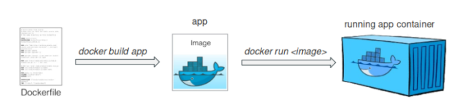

# Docker - Cheatsheet

## Content

1. Container vs VM
2. Docker CLI
3. Dockerfile
4. Docker Image
5. Docker Compose
6. Volumes - mount bind, volumes, tmpfs,
7. Container Registry

## Container vs VM

**What are containers?**
Containers are a type of virtualization technology that allows applications and their dependencies to be packaged in an isolated and portable package. Containers are a type of "ship" that abstracts applications from the underlying infrastructure and allows them to run in a unified environment, regardless of the platform on which they run. Containers enable developers to quickly build, test, and deploy applications without having to worry about the specific details of the underlying infrastructure.

**What are VMs?**
VMs stands for "Virtual Machines". VMs are a type of virtualization technology that allows multiple virtual operating systems to run on a single physical machine. Each virtual machine runs as a separate and isolated environment, with its own virtualized hardware, including CPU, memory, storage, and network interfaces.
VMs are created by software called a hypervisor or virtual machine monitor (VMM) that creates a layer of abstraction between the physical hardware and the virtual operating systems. This layer of abstraction enables multiple operating systems to share a single physical server, allowing for greater efficiency, flexibility, and scalability in deploying and managing IT resources.

**The difference**
.png)

## Docker CLI

- Docker CLI (Command Line Interface) is a command-line tool used to interact with Docker and manage Docker containers, images, networks, and other Docker components from a terminal or command prompt.

- **Build an image:** `docker build -t myimage:latest .`
- **Run a container:** `docker run -p 80:80 nginx`
- **Stop a container:** `docker stop mycontainer`
- **List all images:** `docker images -a`
- **Pull an image**: `docker pull nginx:latest`
- **Push an image:** `docker push myname/myimage:latest`
- **Create volume:** `docker volume create myvolume`
- **Remove an volume:** `docker volume rm myvolume`
- **Execute command in container:** `docker exec mycontainer ls`
- **List all running container:** `docker ps`
- **Remove container:** `docker rm <container-id>`
- **Tag an image:** `docker tag myimage myname/myimage:v1.0.0`
- **Removes a Docker image from the local machine:** `docker rmi`

## Dockerfile

- A Dockerfile is a text file that contains a set of instructions for building a Docker image, which can be used to create and run Docker containers.

```dockerfile
#~ mynodeapp.dockerfile ~#
FROM node:14 # specify the base image from this container

WORKDIR /app # sets the container working dir to /app

COPY package*.json ./ # copy (in regex) file with package*.json to con. dir

RUN npm install # command to install all npm packages

COPY . . # copy all files from the current computer dir to the container dir

EXPOSE 3000 # exposes the port 3000 public so you can reach it 

CMD [ "npm", "start" ] # executes an cmd command 
```

**Build image:**
```bash
docker build -t mynodeapp -f mynodeapp.dockerfile .
```
- **-t** sets the tag/name
- **-f** specify dockerfile name
- **.** the context where it should build (dot means current dir)

**Run container:**
```bash
docker run -p 3000:3000 mynodeapp
```
- **-p** open ports (container:host)

## Docker Image

- Docker images are the building blocks of Docker containers. An image is a snapshot of an application and its dependencies at a specific point in time build in dockerfile. Like a ISO.
- Docker images are created using a Dockerfile, which is a text file that contains the instructions needed to build the image. Once an image is built, it can be stored in a registry, such as Docker Hub, or on a local machine.

**Build image:**
```bash
docker build -t mynodeapp -f mynodeapp.dockerfile .
```
- **-t** sets the tag/name
- **-f** specify dockerfile name
- **.** the context where it should build (dot means current dir)

**Run container:**
```bash
docker run -p 3000:3000 mynodeapp
```
- **-p** open ports (container:host)
 

(Image from Internet)

## Docker Compose

- Docker Compose is a tool for defining and running multi-container Docker applications. It allows you to define your application's services, networks, and volumes in a single YAML file, making it easy to spin up and tear down complex multi-container environments with a single command.

```yaml
version: '3' # docker compose version

services: # creates services
  frontend: # frontend service
    image: node:14-alpine # specify image
    command: npm run dev # shell command
    volumes:
      - ./frontend:/app # imports /frontend to /app in container
    ports:
      - 3000:3000 # exposes and open port 3000 to host
    depends_on: # depends which service attribute 
      - backend
  backend: # backend service
    image: node:14-alpine # specify image
    command: npm run start # shell command
    volumes:
      - ./backend:/app # binds /backend to :/app in container
      - user_data:/app/data # binds userdata to container
    depends_on: # depends which service attribute
      - database
  database: # database service
    image: mysql:5.7 # specify image
    environment: # set senviroment variable
      - MYSQL_ROOT_PASSWORD=password
      - MYSQL_DATABASE=myapp
      - MYSQL_USER=myuser
      - MYSQL_PASSWORD=mypassword
    volumes:
      - db_data:/var/lib/mysql # binds volume

volumes:
  db_data: # volume for database data
  user_data: # volume for user data
```

## Docker volumes

-   Mount bind volumes are useful for sharing data between the host machine and the container.
-   Volumes are useful for persisting data across container restarts and for sharing data between multiple containers.
-   tmpfs volumes are useful for storing temporary data that doesn't need to be persisted.

1.  Mount Bind: A mount bind volume is a way to mount a specific directory on the host machine into a container. It allows a container to access and modify files on the host machine. To create a mount bind volume, use the `-v` or `--mount` flag with the `type=bind` option, followed by the path to the host directory and the path to the container directory. For example:

```bash
docker run -v /host/directory:/container/directory my-image
```

2.  Volumes: A volume is a persistent data storage mechanism that is managed by Docker. It allows a container to store and retrieve data even if the container is stopped or deleted. To create a volume, use the `docker volume create` command, followed by the volume name. To use a volume in a container, use the `-v` or `--mount` flag with the `type=volume` option, followed by the volume name and the path to the container directory. For example:

```bash
docker volume create my-volume 
docker run -v my-volume:/container/directory my-image
```


3.  tmpfs: A tmpfs volume is a memory-backed volume that is not persisted to disk. It allows a container to store and retrieve data in memory, which can be useful for temporary files or other data that doesn't need to be persisted. To create a tmpfs volume, use the `-v` or `--mount` flag with the `type=tmpfs` option, followed by the path to the container directory. For example:

```arduino
docker run -v /container/directory --mount type=tmpfs my-image
```

>Note that these volume types can also be used in a Docker Compose file, and can be managed using the `docker volume` command.

## Container Registry

- A container registry is like github, where you store code and other stuff. In container registries you store container images. You can easily manage, upload, download, update your container images. 


### Public Registry
> A **public registry** is a Docker registry that is publicly accessible and allows anyone to push and pull Docker images from it.

1.  [Docker Hub](https://hub.docker.com/)
2.  [Quay.io](/ch-tbz-it/Stud/m347/-/blob/main/Quay.io)
3.  [Google Container Registry](/ch-tbz-it/Stud/m347/-/blob/main/gcr.io)
4.  [Amazon Elastic Container Registry](https://docs.aws.amazon.com/AmazonECR/latest/public/what-is-ecr.html)
5.  [GitLab Container Registry](https://docs.gitlab.com/ee/user/packages/container_registry/)

### Privat Registry
> A **private registry** is a Docker registry that is not publicly accessible and requires authentication to push and pull Docker images from it. Private registries are typically used for storing sensitive or proprietary Docker images that are not intended for public consumption.

1. [Docker Trusted Registry (DTR)](https://dockerlabs.collabnix.com/beginners/dockertrustedregistry.html)
2. [Harbor](https://goharbor.io/)
3. [Amazon Elastic Container Registry Private](https://docs.aws.amazon.com/AmazonECR/latest/userguide/Registries.html)
4. [Google Container Registry Private](/ch-tbz-it/Stud/m347/-/blob/main/gcr.io)
5. [Azure Container Registry](https://azure.microsoft.com/en-us/products/container-registry)