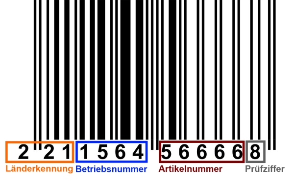

## OCR
### Beschreibung
OCR steht für Optical Character Recognition (Optische Zeichenerkennung). Es ist eine Technologie, die verwendet wird, um gedruckten oder handgeschriebenen Text automatisch in maschinenlesbaren Text umzuwandeln. OCR ermöglicht es, gedruckten Text von Dokumenten, Büchern, Schildern usw. zu extrahieren und digital zu verarbeiten.

## Bar
### Beschreibung
Ein Barcode ist eine maschinenlesbare Darstellung von Informationen in Form von Strichen und Lücken, die auf Produkten, Verpackungen oder Etiketten gedruckt sind. Barcodes werden verwendet, um Informationen wie Produktcodes, Preise und andere Daten automatisch zu erfassen und zu verarbeiten.

### Funktionsweise
- https://www.youtube.com/watch?v=GOYRT3-0IJI

> 
*https://external-content.duckduckgo.com/iu/?u=https%3A%2F%2Fwww.labelfox.com%2Fwp-content%2Fuploads%2F2014%2F02%2FBestandteile_GTIN-13.jpg&f=1&nofb=1&ipt=62faa8de1d9a504a5916d55aec8b88a0a47e537385ab56bc9677cd0daee531ab&ipo=images*

## QR
### Beschreibung
Ein QR-Code (Quick Response Code) ist ein zweidimensionaler Barcode, der Informationen in Form von quadratischen Modulen speichert. QR-Codes werden häufig für verschiedene Anwendungen eingesetzt, wie z.B. Produktverfolgung, Werbung, mobile Zahlungen und vieles mehr.

### Arten
1. **Micro QR-Code:** Ein kleiner QR-Code, der weniger Daten speichern kann als ein Standard-QR-Code. Er besteht aus einer Matrix von 17x17 bis 29x29 Modulen.
    
2. **Standard QR-Code:** Der am häufigsten verwendete QR-Code-Typ. Er besteht aus einer Matrix von 21x21 bis 177x177 Modulen und kann verschiedene Arten von Daten speichern.
    
3. **Large QR-Code:** Ein QR-Code mit einer größeren Anzahl von Modulen als ein Standard-QR-Code. Er kann bis zu 177x177 oder sogar 233x233 Module umfassen, was bedeutet, dass er mehr Daten speichern kann.
    
4. **High Capacity QR-Code:** Ein QR-Code mit erhöhter Speicherkapazität, der eine größere Datenmenge als ein Standard-QR-Code aufnehmen kann. Dies wird durch die Verwendung von mehr Modulen und einer höheren Fehlerkorrekturfähigkeit erreicht.
    
5. **High Density QR-Code:** Ein QR-Code, der eine höhere Informationsdichte aufweist und daher mehr Daten in einem begrenzten Bereich speichern kann. Dies wird erreicht, indem kleinere Module verwendet werden, was zu einer höheren Auflösung führt.
    
6. **Error Correction QR-Code:** Ein QR-Code, der eine verbesserte Fehlerkorrekturfähigkeit aufweist, um beschädigte oder verschmutzte Codes zu erkennen und zu korrigieren. Dadurch bleibt der QR-Code auch dann lesbar, wenn Teile davon unlesbar sind.

### Funktionsweise
- https://www.youtube.com/watch?v=yiLjWBfQyF4&pp=ygUad2llIGxpZXNzdCBtYW4gZWluIGJhcmNvZGU%3D

