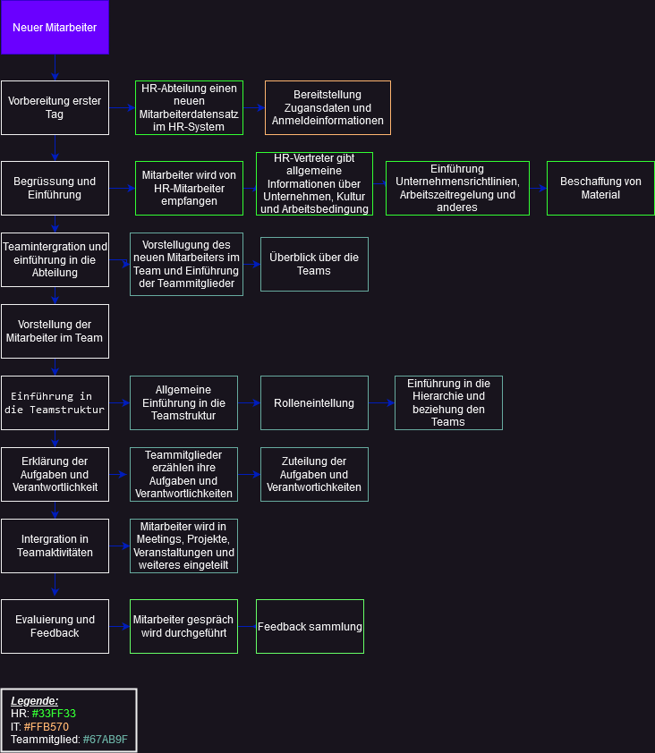

## Prozess 
1. Vorbereitung vor dem ersten Arbeitstag:
    -   HR-Abteilung erstellt einen neuen Mitarbeiterdatensatz im HR-System.
    -   IT-Abteilung richtet die erforderlichen Zugriffsrechte auf IT-Systeme ein.
    -   Bereitstellung von Zugangsdaten und Anmeldeinformationen für die verschiedenen internen Systeme.
    
2.  Begrüßung und Einführung am ersten Arbeitstag:
    -   Neuer Mitarbeiter wird von einem HR-Vertreter empfangen und begrüßt.
    -   HR-Vertreter stellt allgemeine Informationen über das Unternehmen, die Kultur und die Arbeitsbedingungen vor.
    -   Einführung in die Unternehmensrichtlinien, Arbeitszeitregelungen und sonstige relevante interne Vorschriften.
    -   Bereitstellung von Arbeitsmaterialien wie Laptop, Mobiltelefon, Büromaterial, etc.
    
3.  Teamintegration und Einführung in die Abteilung:
    -   Vorstellung des neuen Mitarbeiters im Team und Einführung der Teammitglieder.
    -   Überblick über die Team
    
4.  Vorstellung des neuen Mitarbeiters im Team:
    -   Der Vorgesetzte oder ein dafür verantwortlicher Mitarbeiter stellt den neuen Mitarbeiter den Teammitgliedern vor.
    -   Es werden Informationen zu Hintergrund, Erfahrungen und Kompetenzen des neuen Mitarbeiters geteilt.
    -   Ziel ist es, eine positive Arbeitsbeziehung aufzubauen und das Vertrauen zwischen den Teammitgliedern zu stärken.
    
5.  Einführung in die Teamstruktur:
    -   Dem neuen Mitarbeiter wird ein Überblick über die Teamstruktur gegeben.
    -   Informationen zu den verschiedenen Rollen und Positionen innerhalb des Teams werden vermittelt.
    -   Der Mitarbeiter erhält Einblick in die Hierarchie und die Beziehungen zwischen den Teammitgliedern.

6.  Erklärung der Aufgaben und Verantwortlichkeiten:    
    -   Jedes Teammitglied wird vorgestellt und seine spezifischen Aufgaben und Verantwortlichkeiten werden erläutert.
    -   Der neue Mitarbeiter erhält Informationen darüber, an wen er sich bei Fragen oder Problemen in bestimmten Bereichen wenden kann.
    -   Es wird deutlich gemacht, wie die Zusammenarbeit und die Kommunikation innerhalb des Teams ablaufen.

7.  Integration in Teamaktivitäten:
    -   Der neue Mitarbeiter wird in Teamaktivitäten wie Meetings, Projekte oder Teambuilding-Veranstaltungen eingebunden.
    -   Ziel ist es, den Mitarbeiter in das Team zu integrieren, den Teamgeist zu stärken und die Zusammenarbeit zu fördern.
    -   Es werden Möglichkeiten geschaffen, um informelle Beziehungen innerhalb des Teams aufzubauen und den Austausch von Wissen und Erfahrungen zu ermöglichen.
    
8. Evaluierung und Feedback:
    -   Regelmäßige Evaluierung der Fortschritte und Leistung des neuen Mitarbeiters.
    -   Feedbackgespräche, um Stärken und Entwicklungsbereiche zu identifizieren und Unterstützung anzubieten, um die Leistung zu verbessern.
    -   Unterstützung bei der beruflichen Weiterentwicklung und Karriereplanung des Mitarbeiters.

## Flowdiagramm

