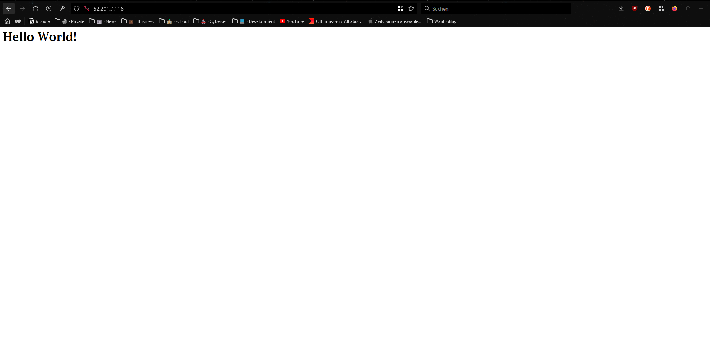
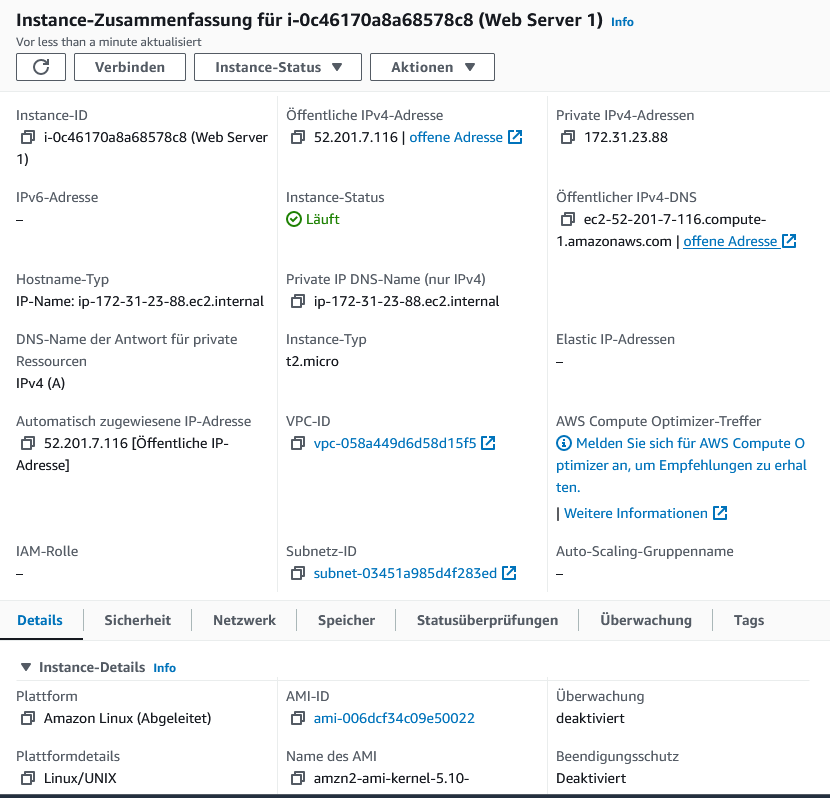
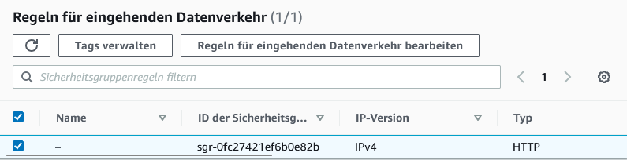

### Amazon EC2

**Link**
http://52.201.7.116/
**Screenshot of website**

**EC2 Instance**


**Security Group**



## Amazon S3

URL: http://bucketlucketmlucket.s3-website.eu-central-1.amazonaws.com/

**Buckets list**


**Website Screenshot**


**Bucket files**


**Static website**


## Access with Password

```yaml
#cloud-config
users:
  - name: ubuntu
    sudo: ALL=(ALL) NOPASSWD:ALL
    groups: users, admin
    home: /home/ubuntu
    shell: /bin/bash
    lock_passwd: true
    plain_text_passwd: 'password' 
  - name: tbz
    sudo: ALL=(ALL) NOPASSWD:ALL
    groups: users, admin
    home: /home/tbz
    shell: /bin/bash
    lock_passwd: false
    plain_text_passwd: 'password'
ssh_pwauth: true
disable_root: false
```

**Password Login TBZ User**


**Password Login Ubuntu User**

Doesn't work because its locked

## Access with SSH Key


### Access with SSH Key and Cloudinit
**SSH Cloudinit**
```yaml
#cloud-config
users:
  - name: ubuntu
    sudo: ALL=(ALL) NOPASSWD:ALL
    groups: users, admin
    home: /home/ubuntu
    shell: /bin/bash
    ssh_authorized_keys:
      - ssh-rsa AAAAB3NzaC1yc2EAAAADAQABAAABAQCB4/e2KkopLrTo+KfbeuKKhuTEpsQ+sgPk
pAfQUQP2Eow/aqjhHN6tkQwAj4JgTEZ3z7A33Zi0CSEUHiuki0SJWP6ivXoocsNE
fzfXsVLuEt+stO+I7bpT7cl8mF+hC9Dq4E0j/JVvmjpoPL+FmzNv3gFUFO29iZfx
9qBJpB8FwYCvcWMDAn3zTLhYVd4qapa3nsf8Eky6RWyMd49vOOUG/IdQY37/wt/y
A04yE4sPZBIdilMH6tZ+FCOUY6U7fwYFKUIHqqnyxJkPEXB7qDttcmWLrk1UzxH0
nonSNjIEg0T8vFzUVKEMhCsVlQOnGOBwBmIABFpEXrut+bcCt6FF aws-key
ssh_pwauth: false
disable_root: false
```

**Login**
